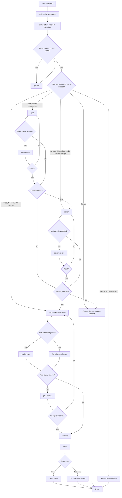
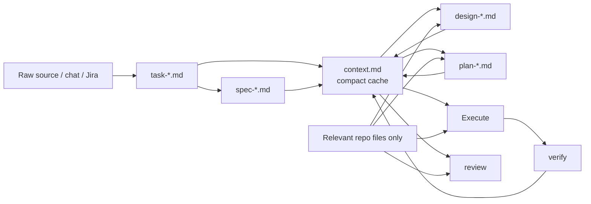

# Agent Work Skills

A generic work workflow with specialized software-engineering stages. The system is **artifact-driven**: each skill has one job, stages are optional, and the durable task record in Obsidian is the handoff point between agents/tools.

**Center file:** [`CLAUDE.md`](CLAUDE.md) — always-on policy. Loaded at this repo’s project root, and globally after `./scripts/link-skills.sh all` (`~/.claude/CLAUDE.md` + Cursor always-apply rule). That script also installs `skills/*/SKILL.md`.

## Core model

```text
Capture -> Clarify -> Define -> Design -> Plan -> Execute -> Verify -> Review
```

Not every task uses every stage.

- **Capture** — `work-intake-automation`: what work exists?
- **Clarify** — `grill-me`: what is ambiguous or assumed?
- **Define** — `spec`: what exactly should be true?
- **Design** — `design`: how should it work?
- **Plan** — `plan-intake-automation` + `coding-plan`: what executable steps will we take?
- **Verify** — `verify`: did the result satisfy the task/spec?
- **Review** — artifact-specific review: is this artifact/result good enough to proceed?

## Workflow diagram



## Recommended paths

### Small task

```text
work-intake-automation -> execute -> verify (when useful)
```

### Clear software change

```text
work-intake-automation
-> plan-intake-automation
-> coding-plan
-> execute
-> verify
-> code-review
```

### Normal feature

```text
work-intake-automation
-> grill-me              # only if unclear
-> spec
-> design                # only if non-trivial solution design is needed
-> plan-intake-automation
-> coding-plan
-> plan-review           # optional pressure test
-> execute
-> verify
-> code-review
```

### High-risk / platform / architecture change

```text
work-intake-automation
-> grill-me
-> spec
-> spec-review
-> design
-> design-review
-> plan-intake-automation
-> coding-plan
-> plan-review
-> execute
-> verify
-> code-review
```

### Non-coding work

```text
work-intake-automation
-> grill-me?             # ambiguity only
-> spec?                 # durable definition only when useful
-> research / investigate / write / operate / execute
-> verify / result review when useful
```

`work-intake-automation` is intentionally domain-agnostic. A task does **not** become a coding task just because it was captured here.

## Artifact ownership

```text
Projects/<PROJECT_NAME>/<WORK_ID>/
├── task-<slug>.md                 # work-intake-automation: durable ledger
├── context.md                     # compact handoff cache; created lazily
├── spec-<slug>.md                 # spec: optional; one or more over time
├── design-<slug>.md               # design: optional; one or more over time
├── plan-<slug>.md                 # plan-intake / coding-plan: one or more
└── discussion/
    ├── spec-review-<slug>.md       # optional persisted review
    ├── design-review-<slug>.md     # optional persisted review
    └── verification-<slug>.md      # optional detailed evidence
```

For Cursor plans, the **Obsidian plan is the origin** and `~/.cursor/plans/*.plan.md` is a symlink. `coding-plan` retains the existing git-worktree behavior under:

```text
~/workspace/working-place/<WORK_NAME>/<repo-name>
```

with branch:

```text
mark/<WORK_NAME>
```

## Token-efficient context flow

Each stage should receive **artifacts, not conversation history**. The shared policy lives in [`CONTEXT.md`](CONTEXT.md), with a reusable template at [`templates/context.md`](templates/context.md).



The intended compression model is:

```text
raw source/history
    -> normalized task
    -> compact confirmed context
    -> stage-specific artifact
    -> smallest sufficient handoff to next stage
```

`context.md` is **not another log**. Keep it bounded (target <= ~1,200 words), rewrite stale information, preserve only confirmed facts/decisions/relevant code pointers/open blockers, and link to authoritative artifacts instead of copying them. `work-intake-automation` does not create it; later stages create it lazily when useful.

## Skill boundaries

| Skill | Question it answers | Must not own |
|---|---|---|
| `problem-decompose` | What is the problem, split small, with Soln/Pros/Cons — and what must we ask instead of assuming? (**auto-apply**) | spec/design/plan artifacts; full `grill-me` sessions |
| `work-intake-automation` | What work exists and where is its durable record? | spec/design/plan/code |
| `grill-me` | What are we missing or assuming? | solution design / implementation plan |
| `spec` | What should be true? | architecture / implementation order |
| `spec-review` | Is the definition complete and testable? | implementation |
| `design` | How should the desired behavior work? | file-level execution todos |
| `design-review` | Is this a sound solution to the spec? | code changes |
| `plan-intake-automation` | Is the task ready for planning, and where does the plan live? | foundational requirements/design decisions |
| `coding-plan` | How do we implement this software change safely? | changing agreed requirements silently |
| `plan-review` | Is the plan safe and executable? | implementation |
| `verify` | Did the result satisfy the contract? | assuming tests alone prove completion |
| `code-review` | Is the actual code correct against task/spec/design/plan? | redefining requirements |

## Routing principle

Use the **smallest workflow that preserves correctness**. Stages are gates, not ceremony.

A solid task may skip `grill-me`. A tiny task may skip `spec`, `design`, and planning. A research task may never touch `coding-plan`. A risky platform change may use every review gate.
