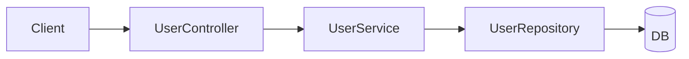
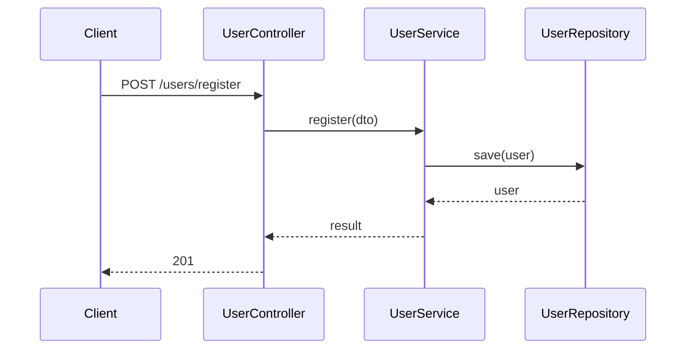

# Coding Plan

Follow [CLAUDE.md](../../CLAUDE.md) for **Understand** and high-level **Plan**. This skill adds **coding-plan-specific** rules for diagram-backed Cursor plans and test-first execution.

**Do not auto-apply.** Load this skill only when the user explicitly requests a coding plan or names `coding-plan`.

**Core rule: test-first.** For behavior changes, write or extend a **failing test first**, then minimal code to pass, then verify. Do not add production logic for new behavior without a failing test (unless the user opts out).

**Core rule: match the project.** New code and tests follow the **same structure and conventions** as that repo.

**Core rule: follow the diagram.** Implementation must match the agreed **implementation outline diagram**. If the design changes, update the diagram first, then todos and code.

**Core rule: work in a worktree.** For an existing repo, implement in a git worktree branched off `main`/`master` as `mark/<task-name>` — see [worktree setup](#worktree-setup-phase-6). Never commit implementation work to `main`/`master`.

**Harness rule:** Run plan phases **in order**; run each todo with the [execution harness](#execution-harness-per-todo). Do not skip gates. On **STOP**, report and wait.

## Plan harness (before code)

| Phase | Do | Verify | STOP if |
|-------|-----|--------|---------|
| **0 — Preconditions** | User named `coding-plan`; read repo layout and 1–2 similar features | Stack and test style identified | Repo unreadable or scope unknown → ask |
| **1 — Quality attributes** | Fill [quality attributes table](#quality-attributes-block-required-in-plan-output) | All three rows filled or N/A with reason | Blank row → STOP; no diagram yet |
| **2 — Feature map** | Name user-visible behaviors; group features | Behaviors trace to acceptance criteria | — |
| **3 — Diagram** | Mermaid component + call flow per feature group | User confirms diagram | User objects or diagram incomplete → revise; STOP before todos |
| **4 — Todos** | One Cursor Plan todo per small e2e iteration; each has `verify:` | Todo count matches iteration outline | Layer-only or file-only todos → fix before implement |
| **5 — Cursor Plan** | Write free vault origin `plan-<slug>.md` (or `plan-<slug>-N.md` if taken) via `$OBSIDIAN_BASE_VAULT_PATH`; symlink free `~/.cursor/plans/<slug>_<short-id>.plan.md` → origin | Vault file exists with YAML todos; `readlink`/`realpath` match; no overwrite | `$OBSIDIAN_BASE_VAULT_PATH` unset or no vault folder known → ask; STOP before implement |
| **6 — Worktree** | For an existing repo path, add a git worktree from `main`/`master` on branch `mark/<task-name>` — see [worktree setup](#worktree-setup-phase-6) | Worktree path exists; `git branch --show-current` = `mark/<task-name>`; base is `main`/`master` | Dirty base repo, branch/worktree name taken, or not a git repo → ask; STOP before implement |

**Forbidden before phase 6 complete:** production code for new behavior (except trivial one-liners user agreed to skip). All implementation happens **inside the worktree**, never on `main`/`master`.

### Plan file layout (phase 5)

**Origin (write content here):**

```text
$OBSIDIAN_BASE_VAULT_PATH/Projects/<PROJECT_NAME>/<WORK_ID>/plan-<slug>.md
```

Vault-relative path (for task ledger and symlinks):

```text
Projects/<PROJECT_NAME>/<WORK_ID>/plan-<slug>.md
```

Prefer the task folder from an existing task record ([`plan-intake-automation`](../plan-intake-automation/SKILL.md) / [`work-intake-automation`](../work-intake-automation/SKILL.md)). If none exists, ask for the vault project/work folder before writing. Read vault root from `$OBSIDIAN_BASE_VAULT_PATH`; if unset → **STOP** and report.

**One task → many plans.** Write a **new** plan file; never overwrite. If `plan-<slug>.md` exists, use `plan-<slug>-2.md`, then `-3`, … until free. **Append** to the task’s **Plans** list and set **Active plan** to the new file. If several plans exist and the user did not say which to execute, ask once — default is **Active plan**.

Use Cursor Plan YAML frontmatter (`name`, `overview`, `todos`, `isProject`) in the vault origin so Cursor can read it through the symlink.

**Cursor path (symlink only):**

```text
~/.cursor/plans/<slug>_<short-id>.plan.md  →  <absolute vault origin>
```

If that Cursor path exists, mint a new `<short-id>` — do not replace the existing symlink/file.

Do not maintain two copies. Write the vault origin to `$OBSIDIAN_BASE_VAULT_PATH/<vault-relative-path>` first, then `ln -s` the Cursor path to the **absolute** vault origin. Verify with `readlink` + `realpath`.

### Worktree setup (phase 6)

Implement in a **dedicated git worktree** branched off the base branch, so `main`/`master` and the user's current checkout stay untouched.

**Applies when** the repo path already exists and is a git repo. If it is not a git repo, or the user asked to work in place, say so and skip this phase.

**Branch name:** `mark/<task-name>` — `<task-name>` is the same kebab-case slug used for `plan-<slug>.md` (from the task record when one exists).

**Worktree path:** sibling of the repo — `<repo-parent>/<repo-name>-<task-name>`. Ask if the user prefers another location.

```bash
REPO_PATH="<existing repo path>"
TASK_NAME="<kebab-case task slug>"

git -C "$REPO_PATH" fetch origin --quiet
# Base branch: prefer main, else master
BASE=$(git -C "$REPO_PATH" show-ref --verify --quiet refs/remotes/origin/main && echo main || echo master)
WORKTREE="$(dirname "$REPO_PATH")/$(basename "$REPO_PATH")-$TASK_NAME"

git -C "$REPO_PATH" worktree add -b "mark/$TASK_NAME" "$WORKTREE" "origin/$BASE"
```

**Rules:**

1. Branch from `origin/main` (or `origin/master`) — never from the current feature branch unless the user asks. No `origin` remote → use the local `main`/`master` ref instead.
2. Never reuse or force an existing branch or worktree path. If `mark/<task-name>` or the path is taken, ask: reuse that worktree, or pick a new suffix (`mark/<task-name>-2`).
3. Verify before any code: worktree directory exists, and inside it `git branch --show-current` prints `mark/<task-name>`.
4. Run all todos, tests, and commands from the worktree path — not the original checkout.
5. Record the worktree path and branch in the plan file so a later session can resume there.
6. Do not remove the worktree when done; the user decides when to `git worktree remove`.

## Quality attributes (required in every plan)

**Reference:** Kleppmann, *Designing Data-Intensive Applications* — reliability, scalability, and maintainability as the three core quality attributes for data-intensive systems. Apply them to every non-trivial coding plan.

**Do not skip.** Before diagrams and Cursor todos, state how the planned work affects each attribute. If an attribute is **not** materially affected, say **N/A** and why in one line — do not leave it blank.

### Reliability

> The system should continue to work correctly even in the face of adversity (hardware or software faults and even human error.)

**Plan must cover:** failure modes, error handling, retries/timeouts, idempotency, data safety, and how tests prove graceful degradation or clear failure.

### Scalability

> As the user grows (data volume, traffic volume or complexity) there should be reasonable ways of dealing with that growth.

**Plan must cover:** expected growth axis (traffic, data, complexity), bottlenecks introduced or removed, and whether the design stays reasonable at 10× without premature optimization.

### Maintainability

> Over time many different people will work on the system (engineering and operations, both maintaining current behavior and adapting the system to new use cases) and they should all be able to work on it **productively**.

**Plan must cover:** layout and naming fit the repo, testability, observability/logging if peers use it, and whether a new contributor can follow the diagram and todos without tribal knowledge.

### Quality attributes block (required in plan output)

Include this table in the plan (chat and Cursor Plan body) before the implementation outline diagram:

| Attribute | Impact on this work | Plan choices |
|-----------|---------------------|--------------|
| Reliability | … | … |
| Scalability | … | … |
| Maintainability | … | … |

Diagrams, feature groups, and todos must reflect material impacts — e.g. reliability → error-path tests in todos; maintainability → match repo layout in diagram labels.

---

## Match the project (before you write)

During **Understand**, inspect how this repo is organized. During **Plan**, state which patterns you will follow.

### Production code

- Same **layout**, **naming**, **patterns** (errors, DI, logging), and **dependencies** as neighboring code.
- Do not invent a new style or add libraries unless asked.

### Tests

Discover what the repo uses, then mirror it:

- **Layout:** co-located `*_test.go`, `__tests__/`, `tests/integration/`, etc.
- **Levels:** unit, integration, e2e — use what similar features use.
- **Style:** same framework, mocks, fixtures, and run commands as peers.

**Not sure** — look at 1–2 similar features, then **ask**.

---

## Plan (coding-plan)

No production code until the plan is agreed (except trivial one-liners).

### 1. Think feature-first

Plan from user-visible features/capabilities, not files or layers.

```text
feature/API behavior → component + call-flow diagram → small e2e feedback-loop todos
```

For each feature, name the behavior first:

- `Register user`
- `Get user info`
- `Reject duplicate email`

Then map the components needed to make that behavior work.

### 2. Ask: split into small e2e iterations?

Map the stack from the codebase:

```text
controller → service → repository / domain → db
```

Ask:

> Split into **feature groups** with **one Cursor Plan todo per small e2e feedback-loop iteration**? Or **one todo** for the full feature?

| Choice | Plan |
|--------|------|
| Split | Feature groups in chat; **each small e2e iteration = separate Cursor Plan todo** |
| One todo | Single todo; verify at API/IT boundary |
| Unsure | Recommend small iterations for 3+ layers or multiple endpoints |

### 3. Implementation outline diagram (required)

Before todos and code, show diagrams for user confirmation.

**Include:**

1. **Component diagram** — layers/boxes and dependencies  
2. **Call flow** — sequence of calls, main functions, errors  

Use **Mermaid**. Use real names from the repo when known.

**Example (register user):**

Component:


```mermaid
flowchart LR
  Client --> UserController
  UserController --> UserService
  UserService --> UserRepository
  UserRepository --> DB[(DB)]
```

Call flow:


```mermaid
sequenceDiagram
  participant C as Client
  participant Ctrl as UserController
  participant Svc as UserService
  participant Repo as UserRepository
  C->>Ctrl: POST /users/register
  Ctrl->>Svc: register(dto)
  Svc->>Repo: save(user)
  Repo-->>Svc: user
  Svc-->>Ctrl: result
  Ctrl-->>C: 201
```

**Rules:**

- Required for non-trivial features; one diagram per feature group (or one diagram with sections).
- Small e2e iterations and Cursor todos must map to the diagram.
- Do not add functions or calls not on the diagram without updating it and asking.

### 4. Feature groups and Cursor todos

| Level | Meaning | Where |
|-------|---------|-------|
| Task | Overall goal | Cursor Plan title |
| Feature group | One API/capability | Chat outline only |
| Small e2e iteration | One thin behavior feedback loop that may touch multiple layers | **One Cursor Plan todo each** |

**Critical:** 5 small e2e iterations in outline → **5 Cursor Plan todos**. Do not nest multiple iterations in one todo.

**Do not split by layer by default.** If the same feature milestone needs controller + service, put them in the **same todo**. Add repository/DB in that same todo too when needed to make that milestone pass.

Prefix titles: `[Register] Slice 1: route through repo stub`

### Todo granularity — small e2e feedback loops

Split todos by **one behavior milestone that can go green**. A todo should touch controller, service, repository, DB, and tests together when those pieces are all needed for that milestone.

| Split todos by (good) | Do not split todos by (bad) |
|------------------------|-----------------------------|
| First green API path: controller + service + repo stub/fake | DTO, request struct, response struct alone |
| Persisting the behavior to the real DB | Controller, service, repo as unrelated layer-only todos |
| One externally visible rule: validation, duplicate email, auth, etc. | Imports, wiring-only, “add file”, rename |
| One end-to-end capability milestone | Single field, mapper line, private helper unless huge |

**Rule:** Everything needed for **one named behavior milestone** lives in **one todo**. Types, helpers, wiring, and stubs that exist only for that milestone belong **inside** that todo — not their own Cursor Plan items.

Only split controller, service, repository, or DB into separate todos when they represent different behavior milestones or the repo explicitly requires separate PR-sized steps.

**Example (register user API):**

- **Good (one todo):** `[Register] Slice 1: controller -> service -> repo stub returns 201` — create the controller API, service, repo interface/stub, request/response types, and tests needed to make the first API path pass.
- **Good (next todo):** `[Register] Slice 2: save user to DB` — update controller/service/repo only as needed to persist through the real DB and verify with repo/IT coverage.
- **Bad (over-split):** todo 1 `CreateUserRequest` · todo 2 `UserController` · todo 3 `UserService` · todo 4 `UserRepository`

Same for other APIs: start with the thinnest passing path, then add persistence, validation, error cases, and integration coverage as separate small e2e iterations.

### 5. Small e2e iteration order (per feature)

Follow the **repo’s real stack**. Typical sequence (skip layers the project doesn’t have):

| Step | Iteration | Do | Verify |
|------|-----------|-----|--------|
| 1 | Thin passing path | Controller route/request + service + repo stub/fake; minimal success response | Highest cheap feature/API test green |
| 2 | Real persistence | Update controller/service/repo/DB together as needed to save the user | Feature/API or integration test proves persistence |
| 3+ | Business rules | Add validation, duplicate checks, domain rules, errors one rule at a time | Feature/API test proves the rule |
| last | Full flow | Only if repo uses IT/e2e | IT or HTTP test green |

Default to the **smallest vertical slice** that proves useful behavior, unless the repo usually does otherwise.

**Inside each todo:** failing feature/API test → minimal code across needed components → verify e2e feedback loop → complete → next. Layer unit tests are support, not the main reason to split todos.

### 6. Example: user APIs

**Plan title:** `User APIs — register + get info`

**Register** — each row is one Cursor Plan todo:

| Todo | Verify |
|------|--------|
| `[Register] Slice 1: controller -> service -> repo stub returns 201` | First feature/API test green |
| `[Register] Slice 2: save user to DB` | Feature/API or integration test proves persistence |
| `[Register] Slice 3: validate request fields` | Feature/API validation tests green |
| `[Register] Slice 4: reject duplicate email` | Feature/API duplicate-error tests green |
| `[Register] Slice 5: full registration flow` | IT green if project has IT |

**Get user info** — separate todos:

| Todo | Verify |
|------|--------|
| `[GetUser] Slice 1: route -> service -> repo stub returns user` | First feature/API test green |
| `[GetUser] Slice 2: load user from DB` | Feature/API or integration test proves DB load |
| `[GetUser] Slice 3: return 404 when missing` | Feature/API not-found tests green |
| `[GetUser] Slice 4: full get-user flow` | IT if project uses it |

### 7. Cursor Plan checklist

Follow [Plan harness](#plan-harness-before-code) phases 0–6. Quick list:

1. Plan mode  
2. **Quality attributes table** — confirm or N/A with reason  
3. Feature groups by user-visible behavior  
4. **Diagram** (component + call flow) — user confirms  
5. Feature groups aligned with diagram and quality attributes  
6. **One Cursor todo per small e2e feedback-loop iteration** with `verify:`  
7. Write vault origin `plan-<slug>.md`; symlink `~/.cursor/plans/*.plan.md` → origin  
8. **Worktree** from `main`/`master` on `mark/<task-name>` — [worktree setup](#worktree-setup-phase-6)  
9. Implement only what the diagram shows — [execution harness](#execution-harness-per-todo) per todo, inside the worktree  

### 8. Ask during planning

Ask if unclear: scope, API contract, layer map, mocks, IT in repo, acceptance criteria.

---

## Execution harness (per todo)

For each Cursor Plan todo, in order:

| Step | Do | Verify | STOP if |
|------|-----|--------|---------|
| **0 — Worktree** | Confirm the working directory is the phase 6 worktree | `git branch --show-current` = `mark/<task-name>` | On `main`/`master` or wrong path → STOP; do not edit code |
| **1 — Scope** | Confirm todo maps to diagram; list files to touch | Matches one behavior milestone | Scope grew → update diagram and plan first |
| **2 — Red** | Write or extend failing test (repo style) | Test fails for the right reason | No test and user did not opt out → STOP |
| **3 — Green** | Minimal code across needed layers | Target test passes | — |
| **4 — Refactor** | Clean up only if needed; keep tests green | Related tests still pass | Regression → fix before next todo |
| **5 — Complete** | Mark todo done only after verify | `verify:` line satisfied | — |

**Opt out:** user says skip tests — note it in chat; use another verify method if cheap.

---

## Work a plan todo (test-first)

Match the **diagram** for that feature.

```
1. Failing feature/API test (repo style) — verify fails correctly
2. Minimal code across needed components — verify feature/API passes
3. Regression — related tests still pass
```

- One small e2e feedback-loop iteration per todo; mark complete only after verify.
- Scope grows → stop, ask, update diagram and todos.

**Bug fix:** failing test repro when possible. **Refactor:** tests green before and after.

---

## Trivial work

Skip formal plan and diagram; verify if cheap.

---

**Working well if:** plan harness phases 0–6 done, quality attributes table filled, diagram confirmed, work happens in a `mark/<task-name>` worktree off `main`/`master`, code matches call flow, each small e2e iteration is its own Cursor todo with verify, execution harness completed per todo.
