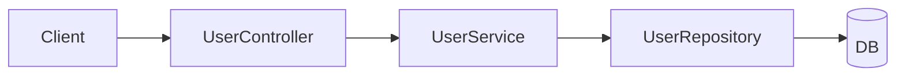
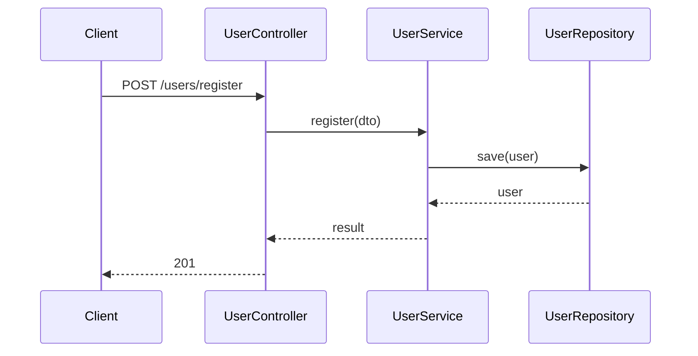

# Coding

Follow [CLAUDE.md](../../CLAUDE.md) for **Understand** and high-level **Plan**. This skill adds coding-specific rules.

**Core rule: test-first.** For behavior changes, write or extend a **failing test first**, then minimal code to pass, then verify. Do not add production logic for new behavior without a failing test (unless the user opts out).

**Core rule: match the project.** New code and tests follow the **same structure and conventions** as that repo.

**Core rule: follow the diagram.** Implementation must match the agreed **implementation outline diagram**. If the design changes, update the diagram first, then todos and code.

---

## Match the project (before you write)

During **Understand**, inspect how this repo is organized. During **Plan**, state which patterns you will follow.

### Production code

- Same **layout**, **naming**, **patterns** (errors, DI, logging), and **dependencies** as neighboring code.
- Do not invent a new style or add libraries unless asked.

### Tests

Discover what the repo uses, then mirror it:

- **Layout:** co-located `*_test.go`, `__tests__/`, `tests/integration/`, etc.
- **Levels:** unit, integration, e2e — use what similar features use.
- **Style:** same framework, mocks, fixtures, and run commands as peers.

**Not sure** — look at 1–2 similar features, then **ask**.

---

## Plan (coding)

No production code until the plan is agreed (except trivial one-liners).

### 1. Ask: split by feature + layer?

Map the stack from the codebase:

```text
controller → service → repository / domain → db
```

Ask:

> Split into **feature groups** with **one Cursor Plan todo per layer sub-step**? Or **one todo** for the full feature?

| Choice | Plan |
|--------|------|
| Split | Feature groups in chat; **each sub-step = separate Cursor Plan todo** |
| One todo | Single todo; verify at API/IT boundary |
| Unsure | Recommend split for 3+ layers or multiple endpoints |

### 2. Implementation outline diagram (required)

Before todos and code, show diagrams for user confirmation.

**Include:**

1. **Component diagram** — layers/boxes and dependencies  
2. **Call flow** — sequence of calls, main functions, errors  

Use **Mermaid**. Use real names from the repo when known.

**Example (register user):**

Component:



Call flow:



**Rules:**

- Required for non-trivial features; one diagram per feature group (or one diagram with sections).
- Sub-steps and Cursor todos must map to the diagram.
- Do not add functions or calls not on the diagram without updating it and asking.

### 3. Feature groups and Cursor todos

| Level | Meaning | Where |
|-------|---------|-------|
| Task | Overall goal | Cursor Plan title |
| Feature group | One API/capability | Chat outline only |
| Sub-step | One layer outcome | **One Cursor Plan todo each** |

**Critical:** 5 sub-steps in outline → **5 Cursor Plan todos**. Do not nest sub-steps in one todo.

Prefix titles: `[Register] Controller: stub POST /users`

### 4. Sub-step order (per feature)

| Step | Layer | Do | Verify |
|------|-------|-----|--------|
| 1 | Controller | Stub route/request + handler | Controller/unit test per repo pattern |
| 2 | Service | Logic; mock downstream | Service unit test |
| 3+ | Repo, domain, DB, … | One todo per component | Test at that layer |
| last | IT | Only if repo uses IT/e2e | IT or HTTP test green |

Default **bottom-up** unless the repo usually does otherwise.

**Inside each todo:** failing test → minimal code → verify → complete → next.

### 5. Example: user APIs

**Plan title:** `User APIs — register + get info`

**Register** — each row is one Cursor Plan todo:

| Todo | Verify |
|------|--------|
| `[Register] Controller: stub POST /users/register` | Route/handler test per repo |
| `[Register] Service: register (mock repo)` | Service unit test green |
| `[Register] Repository: persist user` | Repo test green |
| `[Register] DB: migration if needed` | Migration/DB check green |
| `[Register] IT: full flow` | IT green if project has IT |

**Get user info** — separate todos:

| Todo | Verify |
|------|--------|
| `[GetUser] Controller: stub GET /users/:id` | Controller test per repo |
| `[GetUser] Service: get user (mock repo)` | Service test green |
| `[GetUser] Repository: load by id` | Repo test green |
| `[GetUser] IT: 200 + body` | IT if project uses it |

### 6. Cursor Plan checklist

1. Plan mode  
2. **Diagram** (component + call flow) — confirm  
3. Feature groups aligned with diagram  
4. **One Cursor todo per sub-step**  
5. Implement only what the diagram shows  
6. Verify each todo before the next  

### 7. Ask during planning

Ask if unclear: scope, API contract, layer map, mocks, IT in repo, acceptance criteria.

---

## Work a plan todo (test-first)

Match the **diagram** for that feature.

```
1. Failing test (repo style) — verify fails correctly
2. Minimal code — verify passes
3. Regression — related tests still pass
```

- One layer per todo; mark complete only after verify.
- Scope grows → stop, ask, update diagram and todos.

**Bug fix:** failing test repro when possible. **Refactor:** tests green before and after.

**Opt out:** user says skip tests — note it; verify another way if cheap.

---

## Trivial work

Skip formal plan and diagram; verify if cheap.

---

**Working well if:** diagram confirmed, code matches call flow, each sub-step is its own Cursor todo, tests match the repo.
