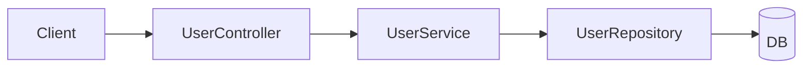
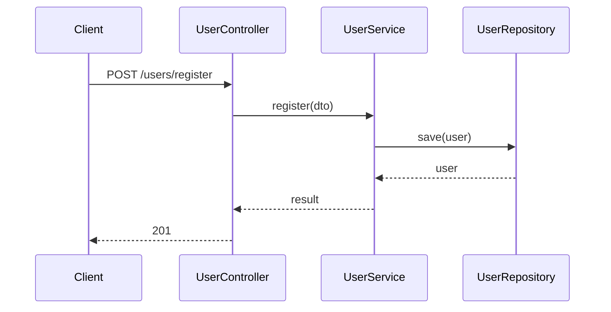

# Coding

Follow [CLAUDE.md](../../CLAUDE.md) for **Understand** and high-level **Plan**. This skill adds coding-specific rules.

**Core rule: test-first.** For behavior changes, write or extend a **failing test first**, then minimal code to pass, then verify. Do not add production logic for new behavior without a failing test (unless the user opts out).

**Core rule: match the project.** New code and tests follow the **same structure and conventions** as that repo.

**Core rule: follow the diagram.** Implementation must match the agreed **implementation outline diagram**. If the design changes, update the diagram first, then todos and code.

## Quality attributes

### Reliability

> The system should continue to work correctly even in the face of adversity (hardware or software faults and even human error.)

### Scalability

> As the user grows (data volume, traffic volume or complexity) there should be reasonable ways of dealing with that growth

### Maintainability

> Over the time many different people will work on the system (engineering and operations, both maintaining current behavior and adapting the system to new use cases) and they should all be able to work on it **productively**

---

## Match the project (before you write)

During **Understand**, inspect how this repo is organized. During **Plan**, state which patterns you will follow.

### Production code

- Same **layout**, **naming**, **patterns** (errors, DI, logging), and **dependencies** as neighboring code.
- Do not invent a new style or add libraries unless asked.

### Tests

Discover what the repo uses, then mirror it:

- **Layout:** co-located `*_test.go`, `__tests__/`, `tests/integration/`, etc.
- **Levels:** unit, integration, e2e — use what similar features use.
- **Style:** same framework, mocks, fixtures, and run commands as peers.

**Not sure** — look at 1–2 similar features, then **ask**.

---

## Plan (coding)

No production code until the plan is agreed (except trivial one-liners).

### 1. Ask: split into small iterations?

Map the stack from the codebase:

```text
controller → service → repository / domain → db
```

Ask:

> Split into **feature groups** with **one Cursor Plan todo per small vertical iteration**? Or **one todo** for the full feature?

| Choice | Plan |
|--------|------|
| Split | Feature groups in chat; **each small iteration = separate Cursor Plan todo** |
| One todo | Single todo; verify at API/IT boundary |
| Unsure | Recommend small iterations for 3+ layers or multiple endpoints |

### 2. Implementation outline diagram (required)

Before todos and code, show diagrams for user confirmation.

**Include:**

1. **Component diagram** — layers/boxes and dependencies  
2. **Call flow** — sequence of calls, main functions, errors  

Use **Mermaid**. Use real names from the repo when known.

**Example (register user):**

Component:



Call flow:



**Rules:**

- Required for non-trivial features; one diagram per feature group (or one diagram with sections).
- Small iterations and Cursor todos must map to the diagram.
- Do not add functions or calls not on the diagram without updating it and asking.

### 3. Feature groups and Cursor todos

| Level | Meaning | Where |
|-------|---------|-------|
| Task | Overall goal | Cursor Plan title |
| Feature group | One API/capability | Chat outline only |
| Small iteration | One thin behavior slice that may touch multiple layers | **One Cursor Plan todo each** |

**Critical:** 5 small iterations in outline → **5 Cursor Plan todos**. Do not nest multiple iterations in one todo.

Prefix titles: `[Register] Slice 1: route through repo stub`

### Todo granularity — small vertical iterations

Split todos by **one behavior milestone that can go green**. A todo may touch controller, service, repository, and tests together if that is the smallest useful iteration.

| Split todos by (good) | Do not split todos by (bad) |
|------------------------|-----------------------------|
| First green API path with stubbed inner behavior | DTO, request struct, response struct alone |
| Persisting the behavior to the real DB | Controller, service, repo as unrelated layer-only todos |
| One externally visible rule: validation, duplicate email, auth, etc. | Imports, wiring-only, “add file”, rename |
| One end-to-end capability milestone | Single field, mapper line, private helper unless huge |

**Rule:** Everything needed for **one named behavior milestone** lives in **one todo**. Types, helpers, wiring, and stubs that exist only for that milestone belong **inside** that todo — not their own Cursor Plan items.

**Example (register user API):**

- **Good (one todo):** `[Register] Slice 1: controller -> service -> repo stub returns 201` — create the controller API, service, repo interface/stub, request/response types, and tests needed to make the first API path pass.
- **Good (next todo):** `[Register] Slice 2: save user to DB` — update controller/service/repo only as needed to persist through the real DB and verify with repo/IT coverage.
- **Bad (over-split):** todo 1 `CreateUserRequest` · todo 2 `UserController` · todo 3 `UserService` · todo 4 `UserRepository`

Same for other APIs: start with the thinnest passing path, then add persistence, validation, error cases, and integration coverage as separate small iterations.

### 4. Small iteration order (per feature)

Follow the **repo’s real stack**. Typical sequence (skip layers the project doesn’t have):

| Step | Iteration | Do | Verify |
|------|-----------|-----|--------|
| 1 | Thin passing path | Route/request -> service -> repo stub or fake; minimal success response | Smallest API/unit test green |
| 2 | Real persistence | Replace stub/fake with repo/DB behavior; add migration if needed | Repo/DB or integration test green |
| 3+ | Business rules | Add validation, duplicate checks, domain rules, errors one rule at a time | Focused unit/API tests green |
| last | Full flow | Only if repo uses IT/e2e | IT or HTTP test green |

Default to the **smallest vertical slice** that proves useful behavior, unless the repo usually does otherwise.

**Inside each todo:** failing test → minimal code → verify → complete → next.

### 5. Example: user APIs

**Plan title:** `User APIs — register + get info`

**Register** — each row is one Cursor Plan todo:

| Todo | Verify |
|------|--------|
| `[Register] Slice 1: controller -> service -> repo stub returns 201` | First API/controller test green |
| `[Register] Slice 2: save user to DB` | Repo/DB or integration test green |
| `[Register] Slice 3: validate request fields` | Validation tests green |
| `[Register] Slice 4: reject duplicate email` | Duplicate/error tests green |
| `[Register] Slice 5: full registration flow` | IT green if project has IT |

**Get user info** — separate todos:

| Todo | Verify |
|------|--------|
| `[GetUser] Slice 1: route -> service -> repo stub returns user` | First API/controller test green |
| `[GetUser] Slice 2: load user from DB` | Repo/DB or integration test green |
| `[GetUser] Slice 3: return 404 when missing` | Not-found tests green |
| `[GetUser] Slice 4: full get-user flow` | IT if project uses it |

### 6. Cursor Plan checklist

1. Plan mode  
2. **Diagram** (component + call flow) — confirm  
3. Feature groups aligned with diagram  
4. **One Cursor todo per small vertical iteration**  
5. Implement only what the diagram shows  
6. Verify each todo before the next  

### 7. Ask during planning

Ask if unclear: scope, API contract, layer map, mocks, IT in repo, acceptance criteria.

---

## Work a plan todo (test-first)

Match the **diagram** for that feature.

```
1. Failing test (repo style) — verify fails correctly
2. Minimal code — verify passes
3. Regression — related tests still pass
```

- One small behavior iteration per todo; mark complete only after verify.
- Scope grows → stop, ask, update diagram and todos.

**Bug fix:** failing test repro when possible. **Refactor:** tests green before and after.

**Opt out:** user says skip tests — note it; verify another way if cheap.

---

## Trivial work

Skip formal plan and diagram; verify if cheap.

---

**Working well if:** diagram confirmed, code matches call flow, each small behavior iteration is its own Cursor todo, tests match the repo.
