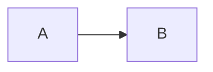

# Design

A design defines **how the spec should be satisfied**. It is not the executable implementation todo list.

## Same folder as the task

Write **only** into the folder that already has `task-*.md`:

```text
Projects/<PROJECT_NAME>/<WORK_ID>/
├── task-<slug>.md
├── design-<slug>.md
└── discussion/questions-design-<slug>.md
```

Never write `discussion/` at the git repo root or vault root. No task file → STOP; name [`work-intake-automation`](../work-intake-automation/SKILL.md) first.

## Harness

| Phase | Do | Verify | STOP if |
|---|---|---|---|
| **0 — Preconditions** | Load task and current spec when present | Requirements are identifiable | No usable task/spec/context |
| **1 — Understand system** | Inspect relevant repo/docs/current behavior before proposing changes | Current-state constraints identified | Required repo/context unreadable |
| **2 — Options** | Consider viable approaches and tradeoffs; reject unnecessary complexity | Chosen approach has rationale | Critical decision unresolved |
| **3 — Design** | Define components, contracts, flows, failures, observability, compatibility, rollout | Design traces to spec/acceptance criteria | Design cannot satisfy a requirement |
| **4 — Diagram** | Add Mermaid component/call/data-flow diagrams where useful | Diagram matches written design | Diagram contradicts prose |
| **5 — Persist** | Write new `design-<slug>.md` in task folder; never overwrite by default. No `status` on the design | Read-back verified | Vault unavailable/write fails |
| **6 — Ledger** | Add the design path to the task **Designs** / **Active design** / execution log | Task points to current design; only the task has work status | Task update fails |
| **7 — Handoff** | Recommend `design-review` or planning | Next stage stated | — |

## Design template

```markdown
---
artifact: design
date: YYYY-MM-DD
task: <vault-relative task path>
spec: <vault-relative spec path | none>
---

# Design: <Title>

## Context
<Current system / constraints.>

## Requirements Trace
- <Spec/acceptance criterion> -> <design response>

## Proposed Design
<Chosen approach.>

## Component / Data / Call Flow


## Interfaces / Data Model
<API, events, schema, contracts, ownership.>

## Failure Handling
- <Failure mode -> response>

## Reliability / Scalability / Maintainability
- **Reliability:** ...
- **Scalability:** ...
- **Maintainability:** ...

## Observability
- <logs / metrics / traces / alerts>

## Compatibility / Migration / Rollout
- <backward compatibility, migration, rollback>

## Alternatives Considered
- <option + why not>

## Open Decisions
- <none | decision already chosen>

## Open Questions
See `discussion/questions-design-<slug>.md` — fill each **A:** line. Template: [`templates/open-questions.md`](../../templates/open-questions.md).
*(none)*
```

Implementation ordering, file-level todos, and test-first steps belong in `coding-plan`.

Do **not** put `status` on the design. Work status and which design is current live on `task-*.md` (**Active design** + execution log).

Questions the user must answer go in `discussion/questions-design-<slug>.md` (fill **A:**), not as a buried list in the design. List that file on the task **Open questions**.

## Context Budget

**Required:** task, active spec when present, `context.md`, and repo-local instructions (`AGENTS.md`/`CLAUDE.md` etc.) if software-related.

**Read only when needed:** directly relevant components, direct callers/callees, 1-2 neighboring patterns, contracts/data models. Expand outward only when blocked.

**Avoid loading:** whole repository trees, unrelated services, archived plans, full git history.

**Context update:** record the active design path, durable decisions (with source links), relevant code/symbol pointers, and remaining blockers. Do not copy diagrams or design prose into `context.md`. See [`../../CONTEXT.md`](../../CONTEXT.md).
