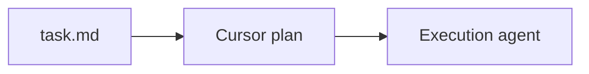

# Plan Intake Automation

Use this skill only after a task record exists. The input is `task.md`; the output is planning artifacts at the paths recorded in that task file.

## Boundary

- `work-intake-automation`: source request -> `task.md`.
- `plan-intake-automation`: `task.md` -> `plan.md`, optional Cursor plan, optional `discussion/` docs.
- Execution happens later; do not change product code while planning.

If `task.md` does not exist, use `work-intake-automation` first.

## Planning Workflow

1. Read `task.md` and restate:
   - goal
   - acceptance criteria
   - assumptions
   - unknowns/blockers
   - recorded paths for `plan.md`, `discussion/`, and optional Cursor plan
2. If acceptance criteria or scope are unclear, ask 1-3 focused questions before writing a plan.
3. Choose the planning artifact:
   - **Obsidian plan:** write `plan.md` at the path recorded in `task.md`.
   - **Cursor plan:** write `<repo>/.cursor/plans/<slug>_<short-id>.plan.md`.
   - **Discussion doc:** write `discussion/<topic>.md` or `discussion/adr-0001-<decision>.md` only for decisions, research, or context that would make `plan.md` noisy.
4. After writing a plan, update `task.md` only for:
   - `status: Planned`
   - changed planning/discussion paths
   - execution log entry with the created artifact path

## Obsidian Writes

When an Obsidian MCP server is available, prefer it for `plan.md` and `discussion/` files in the vault. Use vault-relative paths. If MCP cannot verify the write, report the blocker rather than silently creating a local copy.

Use shell writes only for manual terminal workflows or repo-local Cursor plan files.

## `plan.md` Template

Use this for the Obsidian task folder plan.

```markdown
# Plan: <Title>

## Source

- **Task:** `Projects/<PROJECT_NAME>/<WORK_ID>/task.md`
- **Status:** Planned
- **Planning owner:** <user or agent>
- **Execution owner:** <user or agent>

## Goal

<One paragraph describing the outcome from task.md.>

## Assumptions and Unknowns

- **Assumption:** <Known working assumption>
- **Unknown:** <Question or dependency>

## Approach

1. <Outcome-oriented step>
2. <Outcome-oriented step>

## Todos

- [ ] <Executable outcome> - verify: <test, command, review, or acceptance check>

## Verification

- <How completion is proven>

## Resume Instructions

Start by reading `task.md`, this `plan.md`, and any relevant `discussion/` docs. Track implementation todo progress here unless a Cursor plan file is the active execution plan.
```

## Cursor Plan Template

Use this when the user asks for a Cursor plan or when the execution owner is Cursor.

File path:

```text
<repo>/.cursor/plans/<slug>_<short-id>.plan.md
```

Template:

````markdown
---
name: <Short plan name>
overview: <One-sentence outcome and approach.>
todos:
  - id: <stable-kebab-case-id>
    content: <Outcome-oriented todo>
    status: pending
isProject: false
---

# <Title> Plan

## Goals

- <User-visible outcome or acceptance condition>

## Implementation Approach

### 1) <Feature group>

- <What this changes>
- verify: <test, command, or acceptance check>

## Implementation Outline



## Key Files Likely Touched

- `<path>`

## Verification

- <How the agent proves the task is done>

## Resume Instructions

Start by reading `task.md`, this Cursor plan, and any relevant `discussion/` docs. Track executable todo progress in the YAML frontmatter.
````

For coding plans, also follow the `coding` skill: include implementation diagrams for non-trivial work, use one verifiable todo per layer or cohesive outcome, and include test-first verification.

## Discussion Docs

Use `discussion/` for material that supports the plan but is not the work queue:

- `discussion/notes.md` for research notes or copied source context.
- `discussion/adr-0001-<decision>.md` when there are real tradeoffs.

ADR template:

```markdown
# <Decision Title>

- **Status:** Proposed | Accepted | Superseded
- **Date:** YYYY-MM-DD

## Context

<Why this decision exists.>

## Options

### Option A

- **Pros:** ...
- **Cons:** ...

## Decision

- **Chosen:** <pending or selected option>
- **Consequences:** <What follows>
```

## Rules

- Do not create a new `task.md`; this skill starts from an existing one.
- Do not execute implementation work while planning.
- Keep `task.md` as status/source/path ledger; keep executable todos in `plan.md` or the Cursor plan frontmatter.
- Ask before overwriting an existing plan file.
- Update `task.md` after planning so future sessions can find the active plan.
